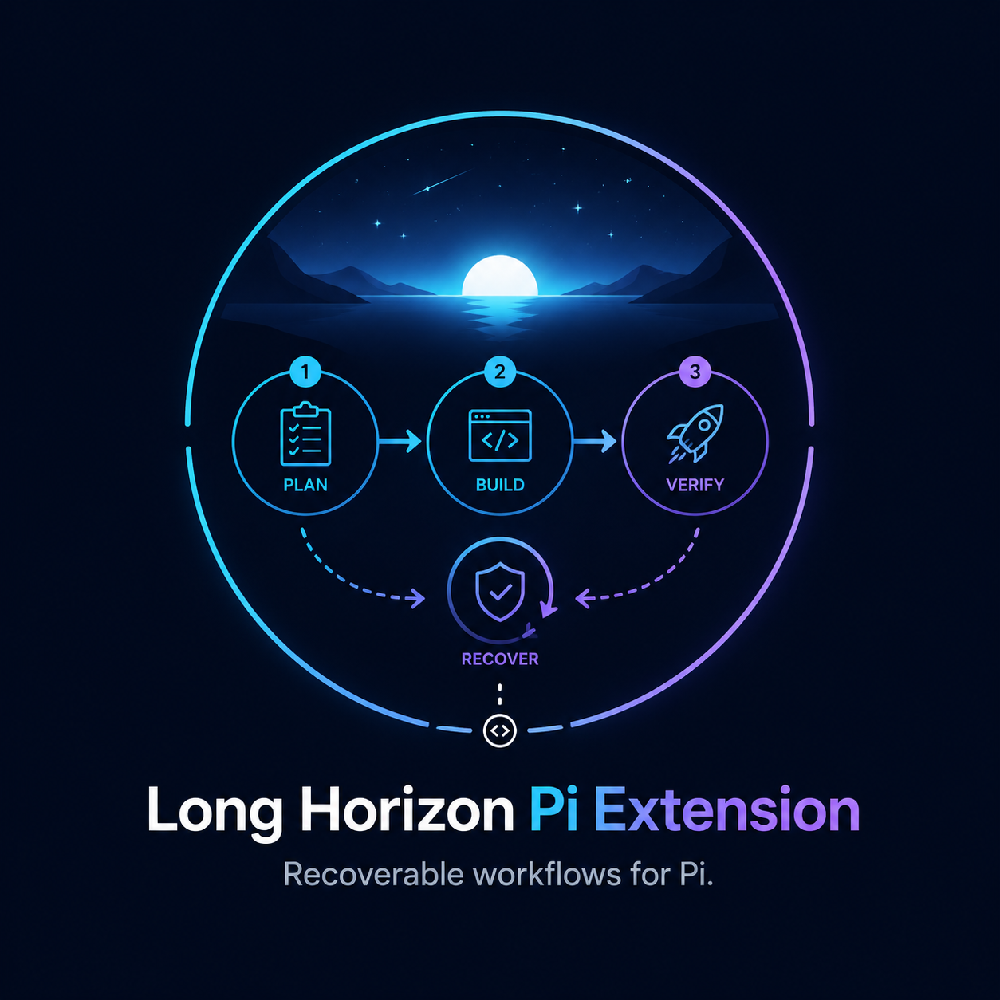

<p align="center">
  
</p>

<h1 align="center">Long Horizon Pi Extension</h1>

<p align="center">Recoverable, section-based workflows for <a href="https://github.com/badlogic/pi-mono">Pi Coding Agent</a>.</p>

<p align="center">
  <a href="./README.zh-CN.md">简体中文</a>
</p>

<p align="center">
  <a href="./package.json"></a>
  <a href="./LICENSE"></a>
</p>

Long Horizon is a standalone Pi extension for coding tasks that span multiple steps or sessions. It treats `plan.md`, `progress.md`, and Git as canonical project state, locks work to the active plan section, records concrete failed attempts, and can commit the files owned by a completed section.

## Highlights

| Capability | What it does |
| --- | --- |
| **Section-scoped execution** | Defaults to one active plan section per Pi query; `/lh multi` allows several sections in one query while preserving a separate completion boundary for each. |
| **Recoverable state** | Reloads `plan.md`, `progress.md`, and Git state at the start of each query instead of relying on a transient conversation-only plan. |
| **Explicit recovery signals** | Records a concrete failed or abandoned approach with `record_attempt_failure`; reopening a completed section does not rewrite Git history. |
| **Owned-change commits** | On section completion, selects files owned by the current run and runtime-touched state for the automatic Git commit rather than indiscriminately committing unrelated dirty files. |
| **Plan-aware compaction** | Preserves a hidden snapshot of `plan.md` and appends only section changes between compactions. |

## Requirements

- Node.js `>=20.6.0`
- Pi Coding Agent `0.73.1` (the repository's development dependency)
- A Git repository if you want automatic commits at section boundaries

> **Installation note:** Pi installs Git packages with production dependencies only. This repository currently declares its required runtime packages in `devDependencies`, so `pi install https://github.com/ZardLi1115/long-horizon-pi-extension` is **not** a supported installation path for this revision. Use a local checkout and `npm install` instead.

## Quick Install

```bash
git clone https://github.com/ZardLi1115/long-horizon-pi-extension.git
cd long-horizon-pi-extension
npm install
```

The checkout can remain separate from the Git project where you use the extension.

## Quick Start

1. In the Git project you want Pi to work on, create `plan.md` and `progress.md`.

   ```markdown
   <!-- plan.md -->
   # Feature plan

   ### Add account settings
   <!-- id: account-settings -->
   <!-- verify: npm test -->

   Implement and test the account settings workflow.
   ```

   ```yaml
   # progress.md
   active: account-settings
   attempts: 0

   done:

   blocker:

   tried:

   next:
   ```

2. Start Pi from that project and load the local extension explicitly.

   ```bash
   cd /absolute/path/to/your-git-project
   pi --extension /absolute/path/to/long-horizon-pi-extension/index.ts
   ```

3. Ask Pi to implement the active section. The extension supplies the current plan, progress, and Git snapshot to the agent. When the work is ready, Pi uses `complete_section` to verify the section, update `progress.md`, and—when Git is available—commit the run-owned changes.

If `progress.md` has no `active` value, the extension chooses the first plan section that is not listed in `done`.

## Plan and Progress Files

Long Horizon recognizes plan sections as level-three Markdown headings (`###`). Add an explicit ID to make a section stable across edits; when an ID is absent, the extension can materialize one from the heading.

```markdown
## Authentication

### Add session refresh
<!-- id: session-refresh -->
<!-- needs: session-storage -->
<!-- verify: npm test -->
<!-- brief: Refresh an expiring user session safely. -->
```

Supported section metadata:

| Metadata | Purpose |
| --- | --- |
| `id` or `section-id` | Stable identifier for the section. |
| `needs` | Comma-separated IDs of prerequisite sections. |
| `verify` | Shell command used by default when `complete_section` does not receive another verification command. |
| `brief` | Optional short description attached to the parsed section. |

`progress.md` is a small YAML-like state file. Its recognized fields are `active`, `attempts`, `done`, `blocker`, `tried`, and `next`.

## Commands

| Command | Description |
| --- | --- |
| `/lh status` | Show the current mode, active section, attempts, Git state, and current run ownership state. |
| `/lh single` | Use the default mode: one user query is locked to one active section, and a successful completion ends that agent loop. |
| `/lh multi` | Allow the same query to continue into later sections; each completed section still has its own commit boundary. |

The selected mode is stored as Pi session data, not as a global Pi configuration change.

## Workflow Tools

| Tool | Use |
| --- | --- |
| `complete_section(id, verify?, skipVerify?, note?)` | Complete the current locked section. It runs supplied or plan-defined verification unless `skipVerify: true` is explicitly chosen, updates `progress.md`, and attempts a scoped Git commit. |
| `record_attempt_failure(id, tried, blocker, next)` | Record one concrete failed or abandoned approach for the active section. Ordinary turns and verification failures do not increment `attempts` automatically. |
| `reopen_section(id, reason?)` | Make a completed section active again without rewriting Git history. |
| `long_horizon_delete(path)` | Delete one file within the current project and register it as owned by the current run. |
| `long_horizon_move(from, to)` | Move one file within the current project without overwriting the target, registering both paths as owned. |

The extension replaces Pi's `write` and `edit` implementations with filesystem operations that validate paths within the current working directory. Completion checks that previously owned content was not changed by another process before it commits.

## Git Boundaries and Recovery

At the start of each user query, Long Horizon reads canonical `plan.md`, `progress.md`, and Git state. A successful section completion writes the next progress state and attempts a commit containing only the current run's owned files plus runtime-touched state such as `progress.md`. Dirty paths that were not acquired by the current run are reported as unowned and are excluded from the automatic commit.

When a run is incomplete, the extension reports the active section, owned and unowned paths, and current dirty paths so the next query can resume from the recorded state.

## Architecture

```text
src/       Host-agnostic workflow core
index.ts   Pi Extension API adapter
tests/     Core and Pi wiring tests
```

The Pi adapter supplies the host integration. Planning, progress tracking, run ownership, Git transactions, filesystem operations, and plan caching are implemented in `src/` so another host adapter can reuse the workflow core.

## Harbor Adapter

The repository also contains a local Harbor custom-agent adapter that starts Harbor's Pi agent with this extension loaded from the checkout. See [the Harbor adapter guide](./harbor_adapter/README.md) for its runtime requirements and commands.

## Development

```bash
npm test
npm run typecheck
```

## License

This project is licensed under the [MIT License](./LICENSE).
